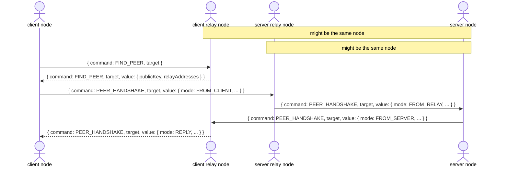

```mermaid
sequenceDiagram
    actor c as client node
    actor cr as client relay node
    actor sr as server relay node
    actor s as server node

    note over cr, s: might be the same node
    note over sr, s: might be the same node

    c ->> cr: { command: FIND_PEER, target }
    cr -->> c: { command: FIND_PEER, target, value: { publicKey, relayAddresses } }

    c ->> sr: { command: PEER_HANDSHAKE, target, value: { mode: FROM_CLIENT, ... } }
    sr ->> s: { command: PEER_HANDSHAKE, target, value: { mode: FROM_RELAY, ... } }
    s ->> cr: { command: PEER_HANDSHAKE, target, value: { mode: FROM_SERVER, ... } }
    cr -->> c: { command: PEER_HANDSHAKE, target, value: { mode: REPLY, ... } }
```
