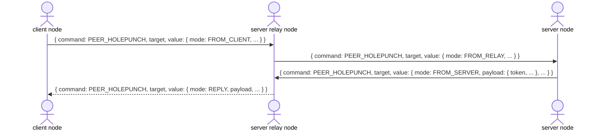
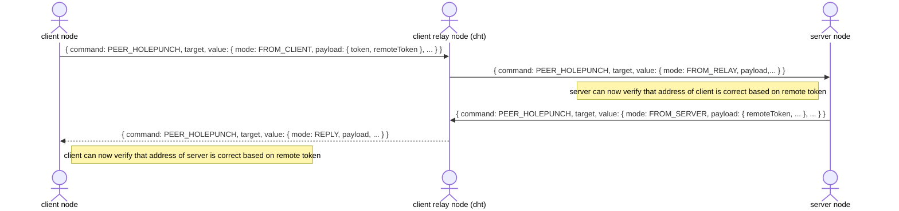
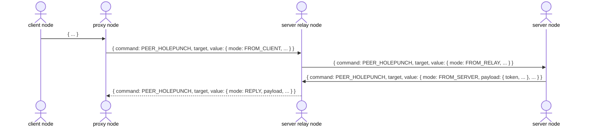
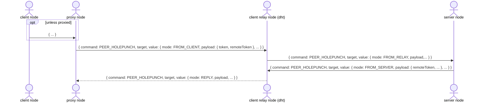
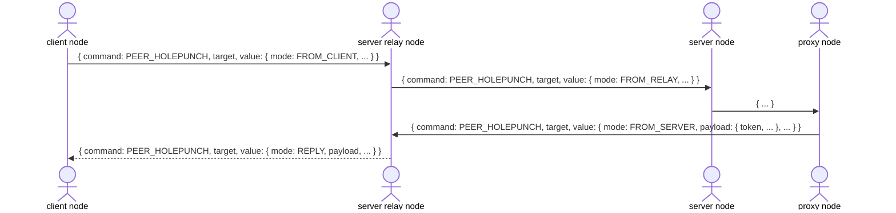
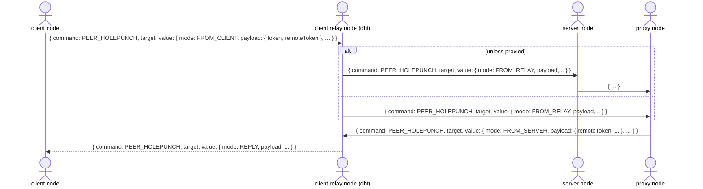

## Holepunch

```mermaid
sequenceDiagram
    actor c as client node
    actor sr as server relay node
    actor s as server node

    c ->> sr: { command: PEER_HOLEPUNCH, target, value: { mode: FROM_CLIENT, ... } }
    sr ->> s: { command: PEER_HOLEPUNCH, target, value: { mode: FROM_RELAY, ... } }
    s ->> sr: { command: PEER_HOLEPUNCH, target, value: { mode: FROM_SERVER, payload: { token, ... }, ... } }
    sr -->> c: { command: PEER_HOLEPUNCH, target, value: { mode: REPLY, payload, ... } }
```

```mermaid
sequenceDiagram
    actor c as client node
    actor cr as client relay node (dht)
    actor s as server node

    c ->> cr: { command: PEER_HOLEPUNCH, target, value: { mode: FROM_CLIENT, payload: { token, remoteToken }, ... } }
    cr ->> s: { command: PEER_HOLEPUNCH, target, value: { mode: FROM_RELAY, payload,... } }

    note left of s: server can now verify that address of client is correct based on remote token

    s ->> cr: { command: PEER_HOLEPUNCH, target, value: { mode: FROM_SERVER, payload: { remoteToken, ... }, ... } }
    cr -->> c: { command: PEER_HOLEPUNCH, target, value: { mode: REPLY, payload, ... } }

    note right of c: client can now verify that address of server is correct based on remote token
```

### Proxying

#### Client

```mermaid
sequenceDiagram
    actor c as client node
    actor p as proxy node
    actor sr as server relay node
    actor s as server node

    c ->> p: { ... }
    p ->> sr: { command: PEER_HOLEPUNCH, target, value: { mode: FROM_CLIENT, ... } }
    sr ->> s: { command: PEER_HOLEPUNCH, target, value: { mode: FROM_RELAY, ... } }
    s ->> sr: { command: PEER_HOLEPUNCH, target, value: { mode: FROM_SERVER, payload: { token, ... }, ... } }
    sr -->> p: { command: PEER_HOLEPUNCH, target, value: { mode: REPLY, payload, ... } }
```

```mermaid
sequenceDiagram
    actor c as client node
    actor p as proxy node
    actor cr as client relay node (dht)
    actor s as server node

    opt unless proxied
    c ->> p: { ... }
    end
    p ->> cr: { command: PEER_HOLEPUNCH, target, value: { mode: FROM_CLIENT, payload: { token, remoteToken }, ... } }
    cr ->> s: { command: PEER_HOLEPUNCH, target, value: { mode: FROM_RELAY, payload,... } }

    s ->> cr: { command: PEER_HOLEPUNCH, target, value: { mode: FROM_SERVER, payload: { remoteToken, ... }, ... } }
    cr -->> p: { command: PEER_HOLEPUNCH, target, value: { mode: REPLY, payload, ... } }
```

#### Server

```mermaid
sequenceDiagram
    actor c as client node
    actor sr as server relay node
    actor s as server node
    actor p as proxy node

    c ->> sr: { command: PEER_HOLEPUNCH, target, value: { mode: FROM_CLIENT, ... } }
    sr ->> s: { command: PEER_HOLEPUNCH, target, value: { mode: FROM_RELAY, ... } }
    s ->> p: { ... }
    p ->> sr: { command: PEER_HOLEPUNCH, target, value: { mode: FROM_SERVER, payload: { token, ... }, ... } }
    sr -->> c: { command: PEER_HOLEPUNCH, target, value: { mode: REPLY, payload, ... } }
```

```mermaid
sequenceDiagram
    actor c as client node
    actor cr as client relay node (dht)
    actor s as server node
    actor p as proxy node

    c ->> cr: { command: PEER_HOLEPUNCH, target, value: { mode: FROM_CLIENT, payload: { token, remoteToken }, ... } }
    alt unless proxied
    cr ->> s: { command: PEER_HOLEPUNCH, target, value: { mode: FROM_RELAY, payload,... } }
    s ->> p: { ... }
    else
    cr ->> p: { command: PEER_HOLEPUNCH, target, value: { mode: FROM_RELAY, payload,... } }
    end
    p ->> cr: { command: PEER_HOLEPUNCH, target, value: { mode: FROM_SERVER, payload: { remoteToken, ... }, ... } }
    cr -->> c: { command: PEER_HOLEPUNCH, target, value: { mode: REPLY, payload, ... } }
```
